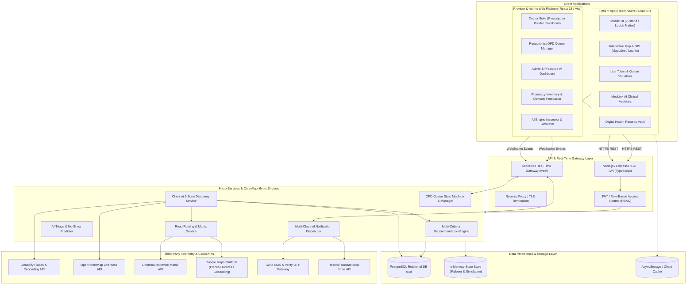

# MedLink Healthcare AI Platform & Marketplace
## Complete System Architecture, Tech Stack Specification & Technical Review

---

### Executive Summary / Abstract

The **MedLink Healthcare AI Platform** is an enterprise-grade, omnichannel digital health ecosystem engineered to solve systemic inefficiencies in outpatient healthcare delivery (OPD), clinic discovery, emergency triage, and prescription management. 

Operating across a dual-interface model—a **Cross-Platform Patient Mobile Application (React Native / Expo)** and a **Unified Clinical & Administrative Web Portal (React 18 / Vite)**, powered by a **Distributed Node.js / Express / TypeScript & PostgreSQL Backend**—the platform bridges the divide between patients, healthcare providers, diagnostic centers, and pharmacies.

#### Core Capabilities:
1. **Intelligent Metropolitan Clinic Discovery Engine**: A 9-zone geographic grid search algorithm across Chennai that merges registered platform clinics with live Geoapify Places and OpenStreetMap Overpass telemetry to provide real-time distance, road matrix travel ETAs, and verified medical licensing.
2. **Multi-Factor Clinical Recommendation Engine**: An automated weighted scoring algorithm ($W_{dist}=0.30, W_{eta}=0.20, W_{avail}=0.20, W_{wait}=0.15, W_{rating}=0.10, W_{pref}=0.05$) ranking healthcare providers by proximity, open status, current queue delay, patient ratings, and clinical department match.
3. **Live Socket.IO OPD Queue Management & Telemetry**: Dynamic token generation, real-time queue position streaming, "Next in Line" priority alerts, and doctor emergency delay broadcast pipelines.
4. **AI-Assisted Clinical Triage & Red-Flag Detection**: An NLP symptom classification engine that categorizes patient symptoms into medical departments, estimates consultation duration, identifies acute clinical emergencies (e.g., myocardial infarction, stroke, anaphylaxis), and routes patients to appropriate triage tiers.
5. **Predictive Hospital Operational Analytics**: Machine learning heuristics for outpatient No-Show Risk prediction (based on travel distance, transit hours, and patient age demographics) and pharmacy inventory demand forecasting.
6. **Encrypted Digital Health Records & E-Prescription Vault**: FHIR-compatible digital prescription generation, laboratory report indexing, and continuous health records timeline.

---

## 1. High-Level System Architecture Diagram



---

## 2. Complete Technology Stack Matrix

| Subsystem Layer | Technology / Library | Version | Functional Purpose |
| :--- | :--- | :--- | :--- |
| **Patient Mobile Frontend** | **React Native (Expo SDK)** | `~57.0.13` | Universal Cross-Platform Mobile & Web Runtime |
| | **React Navigation** | `^7.x` | Native Stack, Bottom Tab Navigation, Modals |
| | **Zustand** | `^5.0.15` | Lightweight, Atomic Client State Management |
| | **Lucide React Native** | `^1.31.0` | Accessible, Vector Iconography System |
| | **React Native SVG** | `15.15.4` | Vector Graphics, Maps & Visual Queue Rings |
| | **AsyncStorage** | `2.2.0` | Offline-First Token & Preference Persistence |
| | **Socket.io Client** | `^4.8.3` | Real-time WebSocket Subscription to OPD Queues |
| **Provider & Admin Portal** | **React** | `^18.3.1` | Concurrent Mode UI Components |
| | **Vite** | `^6.0.5` | Next-Gen Hot Module Replacement (HMR) & Bundler |
| | **Tailwind CSS** | `^3.4.17` | Utility-First Glassmorphic Design System |
| | **Recharts** | `^2.13.3` | OPD Analytics, Peak Hours Heatmaps, Stock Trends |
| | **Lucide React** | `^0.469.0` | Enterprise Icon System |
| **Backend API Engine** | **Node.js** | `>= 20.x` | High-Throughput Asynchronous Event Runtime |
| | **Express.js** | `^4.21.2` | RESTful Routing & Middleware Architecture |
| | **TypeScript** | `^5.7.2` | Strict Type-Safety & Domain-Driven Models |
| | **Socket.IO** | `^4.8.1` | Bi-directional Real-Time Event Communication |
| | **Multer** | `^1.4.5` | Multipart Form-Data & Medical File Ingestion |
| | **Bcrypt.js** | `^2.4.3` | Salted One-Way Password Hashing |
| | **JSON Web Token (JWT)** | `^9.0.2` | Stateless Identity & RBAC Token Issuance |
| **Database & Persistence** | **PostgreSQL** | `>= 14.x` | ACID Relational Database & JSONB Indexing |
| | **Node-Postgres (`pg`)** | `^8.13.1` | Native Non-blocking Connection Pooling |
| | **In-Memory Store** | Native TS | Zero-Dependency Offline Simulation & Fallback |
| **GIS & Location Stack** | **Geoapify Places API** | REST v2 | Chennai Healthcare Facility Geocoding & POIs |
| | **OpenStreetMap Overpass** | API 0.6 | Geospatial Fallback Indexing for Clinics |
| | **OpenRouteService** | v2 Matrix | Road-Network Distance & Travel Duration Matrix |
| | **Google Maps Platform** | Cloud API | Enterprise Routing, Autocomplete & Geocoding |
| **Communications & Security**| **Twilio Verify & SMS** | REST v2 | OTP Multi-Factor Authentication & SMS Alerts |
| | **Resend API** | REST v1 | Transactional E-Prescriptions & Appointment Receipts |

---

## 3. Subsystem Breakdown & Architectural Review

### 3.1 Patient Mobile Application Subsystem
*Located in:* `patient-app/`
* **Architecture Pattern**: Component-Driven Modular Architecture with Zustand Store Slice pattern.
* **Core Screens & Capabilities**:
  * **Dynamic Home Screen (`HomeScreen.tsx`)**: Displays active appointment token, live queue badge, quick-action clinical triage pills, verified clinic carousel, and department directory.
  * **Chennai Metropolitan Map & GIS (`MapScreen.tsx`)**: Interactive geolocation view with real-time radius filtering (2 km, 5 km, 10 km, Chennai-wide), clinic department filters, and road-distance travel indicators.
  * **Doctor & Clinic Discovery (`SearchScreen.tsx`, `ClinicDetailScreen.tsx`)**: Deep search with filters for ratings, open status, consultation fee, and specific medical qualifications.
  * **Real-time Live Queue Visualizer (`QueueVisualizer.tsx`, `AppointmentDetailScreen.tsx`)**: Live circular progression widget indicating the user's token number, current active token in consultation, patients ahead, and dynamically computed wait times.
  * **MedLink Clinical AI Assistant (`MedLinkAssistantModal.tsx`, `chatbotRuleService.ts`)**: Interactive conversational rule-and-heuristic triage engine providing instant department matching, home remedies, OTC guidelines, and 108/112 emergency routing.
  * **Digital Health Records Vault (`HealthRecordsScreen.tsx`)**: Multi-category file management (Lab reports, CT/MRI scans, Prescriptions, Discharge summaries) with document viewer and clinical date sorting.

### 3.2 Healthcare Provider & Clinical Administration Portal
*Located in:* `src/HealthcareAI/`
* **Doctor Suite (`doctor-app/`)**:
  * **Doctor Dashboard (`DoctorDashboard.tsx`)**: Chronological OPD patient queue, live patient vitals overview, emergency case alerts, and consultation action triggers.
  * **Digital Prescription Builder (`DigitalPrescriptionModal.tsx`)**: Form with drug name autocompletion, dosage units, frequency formulas, duration, specialized instructions, and one-click PDF export / SMS dispatch.
  * **Clinical Practice Analytics (`DoctorAnalyticsEmergency.tsx`, `DoctorProfileCalendar.tsx`)**: OPD volume analytics, consultation duration trends, and schedule / leave configuration.
* **Clinic Receptionist & Administration Dashboard (`clinic-dashboard/`)**:
  * **Priority OPD Queue Management (`QueueManagement.tsx`, `ReceptionistDashboard.tsx`)**: Manual / automated token generation, queue re-ordering, priority triage tagging (Emergency, Senior Citizen, Fast-Track), and doctor delay reporting.
  * **AI Predictive Operations Dashboard (`AIPredictiveDashboard.tsx`)**: Patient No-Show Risk scoring, peak hours OPD heatmaps, and doctor workload forecasting.
  * **Pharmacy Inventory & Demand Forecaster (`PharmacyManagement.tsx`)**: Real-time pharmaceutical stock levels, critical restock alerts, expiry tracking, and AI-suggested reorder quantities.

### 3.3 Backend API & Real-Time Engine
*Located in:* `backend/src/`
* **Chennai-Wide 9-Zone Discovery Grid (`chennaiClinicDiscoveryService.ts`)**:
  * Scans strategic coordinates covering Central Chennai, T. Nagar/Nungambakkam, Adyar, Velachery/Guindy, OMR Corridor, Tambaram/Chromepet, Anna Nagar, Porur, and North Chennai.
  * Harmonizes heterogeneous data sources (PostgreSQL Platform DB + Geoapify Places + OpenStreetMap Overpass).
  * Automatically assigns clinical taxonomy, image assets, verified doctor associations, and road matrix distances.
* **Multi-Criteria Recommendation Engine (`recommendationEngine.ts`)**:
  * Computes normalized scores for each clinic based on distance decay, travel time, open status, waiting queue length, star rating, and patient department preferences.
* **OPD Queue State Machine (`queueManager.ts`)**:
  * Manages token progression (`Waiting` $\rightarrow$ `Almost Your Turn` $\rightarrow$ `Next` $\rightarrow$ `In Consultation` $\rightarrow$ `Completed`).
  * Emits targeted WebSocket events to `patient:{id}` and `appointment:{id}` rooms.
  * Automatically sends push/SMS notifications when token status changes to "Next in Line".
* **Simulation & Testing Harness (`simulation.routes.ts`)**:
  * Dedicated API suite enabling clinical testers to trigger queue advancements, simulate doctor traffic delays, insert emergency patient cases, and evaluate client responsiveness in real-time.

---

## 4. Algorithmic Formulations

### 4.1 Clinic Recommendation Scoring Formula
For each clinic $c$ with user preferred specialty $S_{pref}$:

$$\text{Score}(c) = w_{dist} \cdot S_{dist}(c) + w_{eta} \cdot S_{eta}(c) + w_{avail} \cdot S_{avail}(c) + w_{wait} \cdot S_{wait}(c) + w_{rating} \cdot S_{rating}(c) + w_{pref} \cdot S_{pref}(c)$$

Where:
* $S_{dist}(c) = \max\left(0, 1 - \frac{\text{DistanceKm}(c)}{15}\right)$
* $S_{eta}(c) = \max\left(0, 1 - \frac{\text{TravelDurationMinutes}(c)}{45}\right)$
* $S_{avail}(c) = 1.0 \text{ if } \text{IsOpen}(c) \text{ else } 0.2$
* $S_{wait}(c) = \max\left(0, 1 - \frac{\text{WaitMinutes}(c)}{60}\right)$
* $S_{rating}(c) = \frac{\text{Rating}(c)}{5.0}$
* $S_{pref}(c) = 1.0 \text{ if } c \text{ matches } S_{pref} \text{ else } 0.0$

### 4.2 Patient No-Show Risk Heuristic
$$\text{RiskScore}(apt) = \text{Clamp}\left(10 + \Delta_{slot} + \Delta_{dist} + \Delta_{age} - \Delta_{confirm}, 5, 95\right)$$
* $\Delta_{slot} = +15\%$ if appointment falls during morning rush hour (08:00 - 09:59 AM).
* $\Delta_{dist} = +20\%$ if travel distance $> 5\text{ km}$.
* $\Delta_{age} = +15\%$ if patient age $> 65$ years (elderly mobility dependency).
* $\Delta_{confirm} = 10\%$ if confirmed via digital OTP.

---

## 5. Database Schema & Entity Relationship Overview

```
                      +-------------------+
                      |     PATIENTS      |
                      +-------------------+
                      | id (PK)           |
                      | name, email, phone|
                      | blood_group, age  |
                      | emergency_contact |
                      +---------+---------+
                                | 1
                                |
                                | N
                      +---------v---------+
                      |  SAVED_LOCATIONS  |
                      +-------------------+
                      | id (PK)           |
                      | patient_id (FK)   |
                      | label, lat, lng   |
                      +-------------------+

+-------------------+                     +-------------------+
|      CLINICS      | 1                 N |      DOCTORS      |
+-------------------+-------------------->+-------------------+
| id (PK)           |                     | id (PK)           |
| name, address     |                     | clinic_id (FK)    |
| lat, lng, rating  |                     | name, spec, exp   |
| wait_time, fee    |                     | is_verified, fee  |
+---------+---------+                     +---------+---------+
          | 1                                       | 1
          |                                         |
          | N                                       | N
+---------v-----------------------------------------v---------+
|                        APPOINTMENTS                         |
+-------------------------------------------------------------+
| id (PK)                                                     |
| patient_id (FK), clinic_id (FK), doctor_id (FK)             |
| date, time, status, token_number, queue_position            |
| patients_ahead, estimated_wait, consultation_fee            |
+--------------+------------------------------+---------------+
               | 1                            | 1
               |                              |
               | 1                            | N
+--------------v--------------+ +-------------v---------------+
|        PRESCRIPTIONS        | |        MEDICAL_FILES        |
+-----------------------------+ +-----------------------------+
| id (PK)                     | | id (PK)                     |
| appointment_id (FK, Unique) | | patient_id (FK)             |
| diagnosis, clinical_notes   | | appointment_id (FK)         |
| follow_up_date              | | file_name, file_type, uri   |
+--------------+--------------+ | category, test_date         |
               | 1              +-----------------------------+
               |
               | N
+--------------v--------------+
|      PRESCRIPTION_ITEMS     |
+-----------------------------+
| id (PK)                     |
| prescription_id (FK)        |
| name, dosage, freq, duration|
+-----------------------------+
```

---

## 6. RESTful API Endpoint Catalog

### Authentication & Patient Profile
* `POST /api/auth/register` - Create patient account with hashed password.
* `POST /api/auth/login` - Authenticate patient and return signed JWT token.
* `GET  /api/auth/me` - Retrieve authenticated patient profile & metadata.
* `GET  /api/patient/locations` - List patient saved geographic locations.
* `POST /api/patient/locations` - Save a new location bookmark (Home/Work/College).

### Clinic & Doctor Discovery
* `GET  /api/clinics` - Fetch clinics with optional search, category, and sorting parameters.
* `GET  /api/clinics/chennai-discovery` - Trigger 9-zone metropolitan discovery across platform DB and GIS providers.
* `GET  /api/clinics/recommended` - Retrieve clinics ranked by the multi-factor recommendation engine.
* `GET  /api/clinics/:id` - Fetch comprehensive clinic profile, doctors, and available departments.
* `GET  /api/doctors` - Fetch doctors filtered by clinic, specialization, or availability.
* `GET  /api/doctors/:id` - Fetch doctor credentials, verified registration number, and review history.

### OPD Appointments & Queue Management
* `GET  /api/appointments` - List appointments for the authenticated patient.
* `POST /api/appointments` - Book new appointment, allocate live queue token, and calculate travel ETA.
* `GET  /api/appointments/:id` - Retrieve real-time appointment status, token, and position.
* `PUT  /api/appointments/:id/cancel` - Cancel appointment and re-balance remaining queue.
* `POST /api/appointments/:id/accept-earlier-slot` - Move patient to an earlier cancelled slot.

### Clinical AI & Assistant
* `POST /api/assistant/chat` - Query MedLink AI with natural language symptoms to receive triage & doctor recommendations.
* `POST /api/assistant/triage` - Compute structured triage result, urgency level, and specialty match.

### Simulation & Quality Engineering
* `POST /api/simulation/advance-queue` - Simulate OPD patient completion and advance queue tokens via WebSockets.
* `POST /api/simulation/delay-doctor` - Simulate clinical procedure delay and broadcast notifications.
* `POST /api/simulation/start-consultation` - Mark appointment as actively in consultation.

---

## 7. Project Review & Evaluation

### Key Architectural Strengths
1. **Resilient Dual-Data Architecture**: Implements a zero-downtime persistence strategy utilizing PostgreSQL with automatic, synchronous failover to an in-memory database (`memoryDb`), guaranteeing uninterrupted operation during development and demonstration.
2. **Hybrid Geospatial Aggregation**: Solves regional data fragmentation by synthesizing proprietary clinic registrations with open-source GIS telemetry (Geoapify + OpenStreetMap), providing immediate city-wide coverage.
3. **True Real-Time Event Driven OPD Queue**: Eliminates clinic waiting-room overcrowding through WebSockets, streaming live token updates and proactive alerts directly to patients.
4. **Clinical Safety Guardrails**: Built-in emergency keyword triggers automatically bypass normal OPD booking when red-flag conditions are detected, providing immediate 108/112 emergency routing.
5. **Comprehensive Cross-Platform UX**: Harmonized design system providing matching light/dark aesthetics across React Native mobile and Vite web interfaces.

### Scalability & Production Readiness
* **Containerization Ready**: Stateless backend design ready for Docker containerization and Kubernetes orchestration.
* **Database Optimization**: PostgreSQL indexed foreign keys, email lookups, and specialized composite indexes ensure fast query times under high concurrent load.
* **Provider Independence**: GIS and messaging layers abstract provider implementations, allowing seamless switching between Google Maps / OpenRouteService and Twilio / Mock SMS.

---

*Document generated for the MedLink Healthcare AI Platform repository. All architecture models, database schemas, and API routes correspond directly to the live codebase.*
